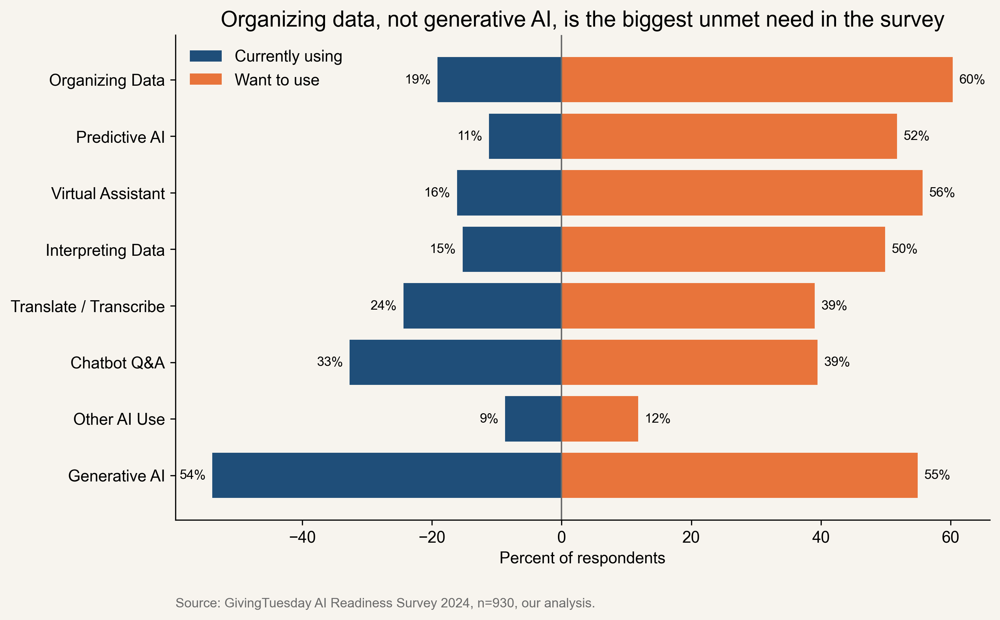
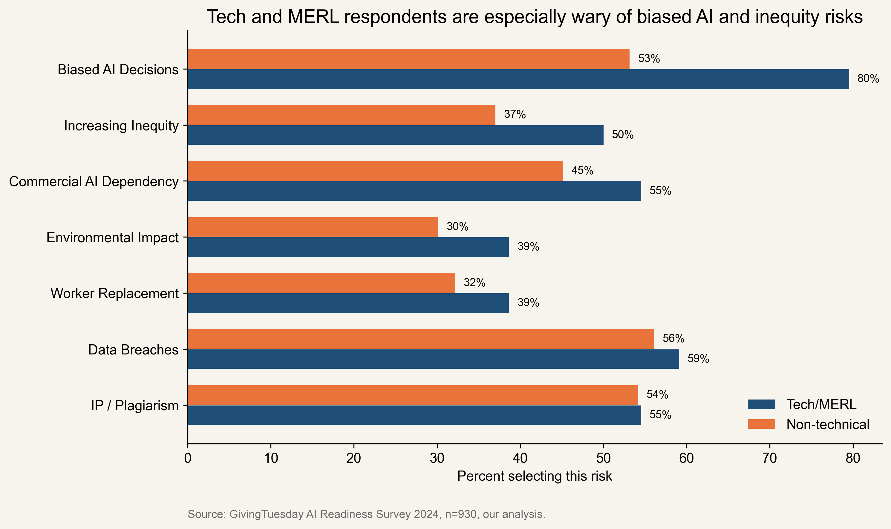
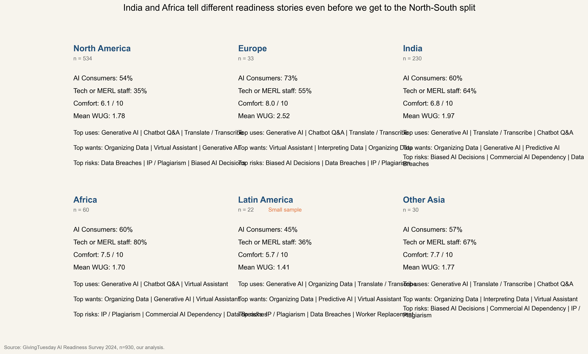
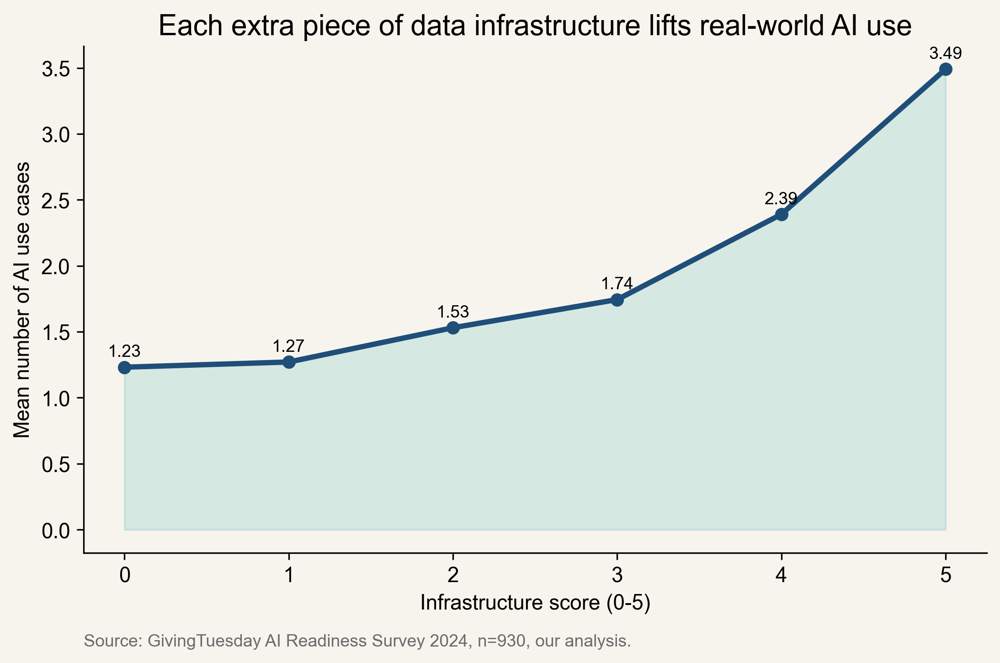
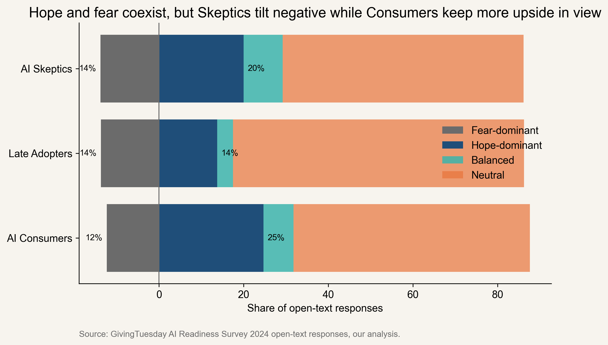
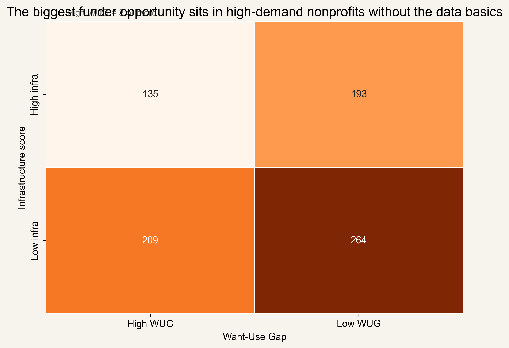

# Why Nonprofits Want AI but Can't Use It

This repository contains a Data Analytics Case Competition submission built on GivingTuesday's 2024 AI Readiness Survey of 930 nonprofits worldwide. My main argument is simple: the nonprofit AI bottleneck looks less like a tooling problem and more like a data infrastructure problem, especially for organizations that want more from AI than their operating setup can currently support.

## Thesis

The biggest unmet need in this dataset is not another chatbot. It is help organizing data, plus the staffing, storage, and policy basics that make AI useful instead of frustrating.

## Key Findings

- **Organizing data is the largest unmet AI need.** 60.3% want it, only 19.1% currently use it, for a 41.2-point gap. See `fig_06_want_use_gap_diverging.png`.
- **Late Adopters carry the biggest Want-Use Gap.** Their average WUG is 2.41, versus 1.81 for AI Consumers and 0.74 for AI Skeptics. See `fig_06_wug_distribution.png`.
- **More than one in five nonprofits sit in the Foundation-needed segment.** 22.47% of the sample wants more from AI but still lacks enough infrastructure to support it. See `fig_06_wug_segment_matrix.png`.
- **Technical respondents are more worried about bias, not less.** 79.5% of Tech/MERL respondents flagged biased AI decisions, versus 53.2% of non-technical respondents, and that gap stayed significant after Holm correction. See `fig_02_risk_by_role_hypothesis.png`.
- **India and Africa are not interchangeable inside the Global South story.** India shows a higher mean WUG (1.97), while Africa shows higher comfort (7.46) and a higher tech-or-MERL staffing rate (80.0%). See `fig_05_regional_scorecard.png`.
- **Infrastructure lifts real AI use.** Organizations with an infrastructure score of 0 average 1.23 AI use cases; at a score of 5, that rises to 3.49. See `fig_08_infrastructure_lift.png`.
- **Hope and fear coexist in the text responses.** One verified quote that captures the caution side: "Working in journalism, a great fear is abusing AI in the creation of trustworthy information & relaying data". See `fig_04_hope_fear_ratio.png`.

## Headline Figures













## Deliverables

- Slide deck: `deliverables/slides/nonprofit_ai_readiness_case_competition.pptx`
- Executed notebooks: `notebooks/*_executed.ipynb`
- Figures: `outputs/figures/`
- Tables: `outputs/tables/`
- Stats logs: `outputs/stats/`

## Reproducibility

1. Install dependencies:
   ```bash
   python -m pip install -r requirements.txt
   ```
2. Run the sanity check:
   ```bash
   python scripts/00_sanity_check.py
   ```
3. Review the analysis notebooks in order:
   - `notebooks/01_eda.ipynb`
   - `notebooks/02_hypothesis_tests.ipynb`
   - `notebooks/03_clustering_deep_dive.ipynb`
   - `notebooks/04_text_analysis.ipynb`
   - `notebooks/05_geo_cause_analysis.ipynb`
   - `notebooks/06_want_use_gap_index.ipynb`
   - `notebooks/07_predictive_model.ipynb`
4. Regenerate the polished figure set and deliverables:
   ```bash
   python scripts/stage8_visualization_polish.py
   python scripts/build_stage9_deliverables.py
   ```

## Methodology Notes

- The raw survey file and the clustering file were merged after verifying the row order and cluster labels.
- `cluster3` is the verified 3-group HDBSCAN split used throughout the narrative: AI Consumers, Late Adopters, and AI Skeptics.
- Multi-select risk responses were parsed into explicit binary indicators before testing.
- The open-text pipeline uses transparent preprocessing, VADER sentiment, and a rule-based hope/fear lexicon so every label can be audited.
- The predictive model is deliberately modest and interpretable. Its purpose is to rank drivers of readiness, not to promise high-accuracy forecasting.

## Key Files

- `findings.json` keeps a ledger of verified claims.
- `scripts/analysis_utils.py` is the shared data-loading, plotting, and logging backbone.
- `scripts/stage2_hypothesis_tests.py` through `scripts/stage8_visualization_polish.py` hold the reusable stage logic behind the notebooks.

## Sources

- GivingTuesday, *AI Readiness and Adoption in the Nonprofit Sector in 2024*: <https://ai.givingtuesday.org/ai-readiness-report-2024/>
- GivingTuesday, *AI Readiness Survey Report 2024 India*: <https://ai.givingtuesday.org/ai-readiness-survey-report-2024-india/>
- data.org, *Data Maturity Assessment*: <https://data.org/dma/>
- World Economic Forum, *The AI divide between the Global North and Global South*: <https://www.weforum.org/stories/2023/01/davos23-ai-divide-global-north-global-south/>

## Author

- [Parshv Patel](https://www.linkedin.com/in/parshv-patel-65a90326b/): 1st year Data Science Student at UC Berkeley

Prepared for the  Data Analytics Case Competition. 
